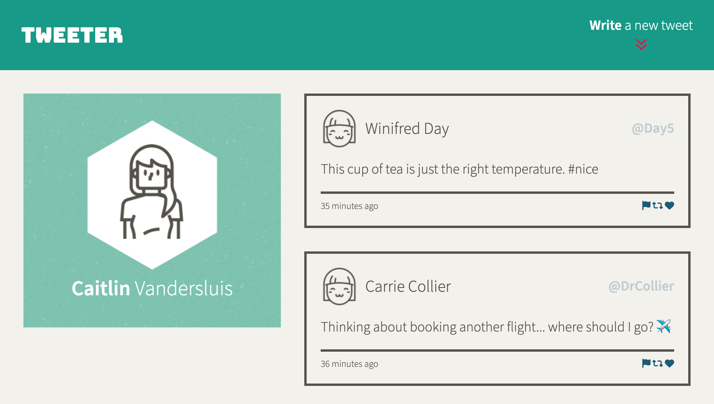
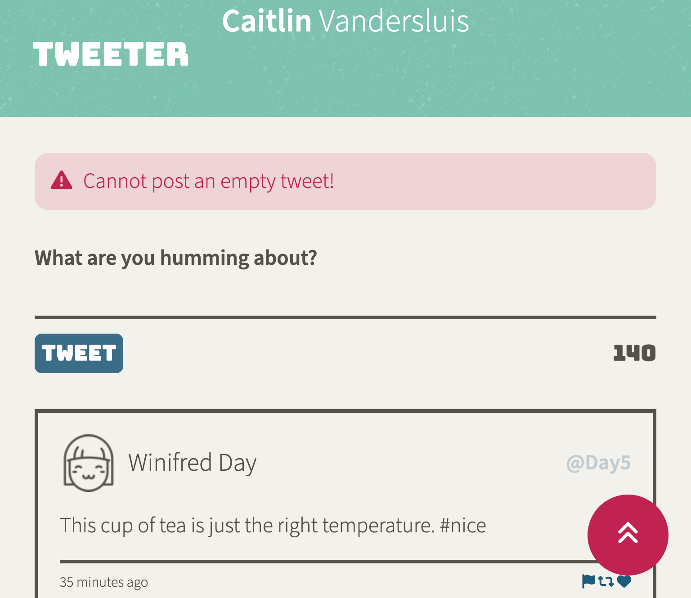
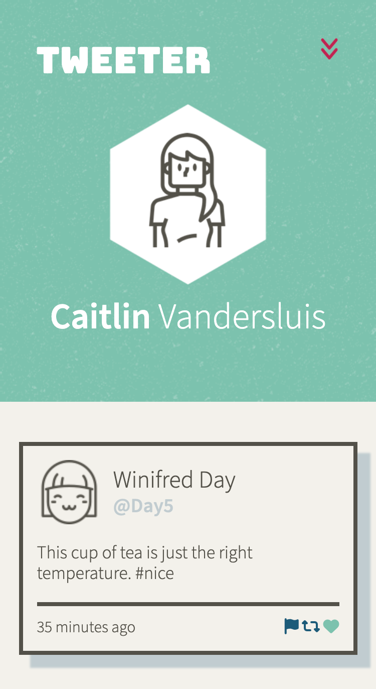

# Tweeter Project

Tweeter is a simple, single-page Twitter clone.

This repository is the starter code for the project: Students will fork and clone this repository, then build upon it to practice their HTML, CSS, JS, jQuery and AJAX front-end skills, and their Node, Express back-end skills.

## Purpose

This project was built as a part of my learnings at [Lighthouse Labs](https://www.lighthouselabs.ca).

## Final Product
Desktop View

Error Message and Scroll to Top Button on Tablet View

Mobile View with Tweet Hover Effects

## Features While Using Tweeter

**Write a New Tweet Button**
- Clicking on animated `Write a new tweet` button toggles showing and hiding tweet form
- Showing tweet form enables text area automatically

**Scroll Button**
- Scrolling down page hides `Write a new tweet` button and instead a scroll to top arrow button appears

**Responsive Design**
- Breakpoints are set for mobile, tablet, desktop, and ultrawide monitors for best viewing pleasure

**Hover Effects**
- Buttons each have hover effects notifing user that the button is clickable
- Individual tweets and tweet icons also have hover effects

**Error Messages**
- Tweets that are empty or over 140 characters will be notifited with a unique error message

## Getting Started

1. [Create](https://docs.github.com/en/repositories/creating-and-managing-repositories/creating-a-repository-from-a-template) a new repository using this repository as a template.
2. Clone your repository onto your local device.
3. Install dependencies using the `npm install` command.
3. Start the web server using the `npm run local` command. The app will be served at <http://localhost:8080/>.
4. Go to <http://localhost:8080/> in your browser.

## Dependencies

- [Express](https://expressjs.com)
- [Node.js](https://nodejs.org) v5.10.x or above
- [Body-parser](https://www.npmjs.com/package/body-parser)
- [Chance](https://www.npmjs.com/package/chance)
- [jQuery](https://jquery.com/)
- [timeago.js](https://cdnjs.com/libraries/timeago.js)
- [SASS](https://www.npmjs.com/package/sass)